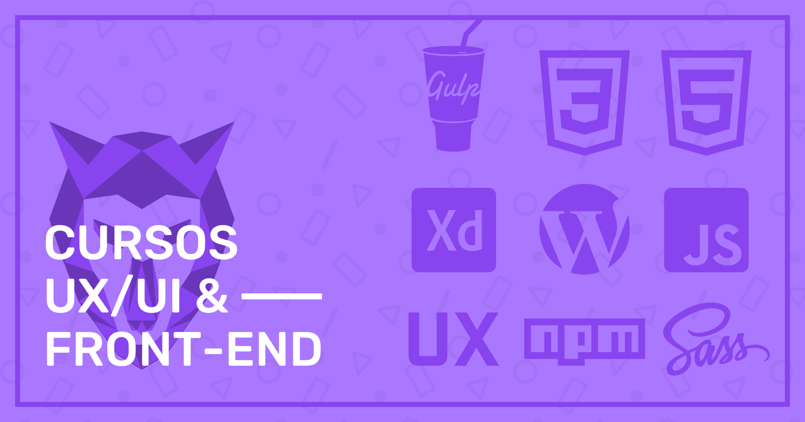

<h1 align="center">
    
</h1>
<h2> Origamid Courses</h2>

👓 My progress in UX, UI &amp; Front End studies at EAD 🐺 Origamid. Projects and Certificates.🏆

 

:white_check_mark: Web Design Completo <a target="_blank" href="https://www.origamid.com/certificate/bec64f6b/"  title="Certificate">🏆</a>  

:white_check_mark: CSS Flexbox <a target="_blank" href="https://www.origamid.com/certificate/14e14adb/"  title="Certificate">🏆</a>

:white_check_mark: UI Design Avançado <a target="_blank" href="https://www.origamid.com/certificate/cfd2884f/"  title="Certificate">🏆</a>

:white_square_button: JavaScript Completo ES6 :hourglass:

:white_large_square: React Completo

:white_large_square: UX Design Heurísticas

:white_large_square: Tipografia Avançada

:white_large_square: CSS Grid Layout

:white_large_square: WordPress Como CMS

:white_large_square: CSS Avançado Posicionamento

:white_large_square: WooCommerce Como CMS

:white_large_square: Bootstrap 4

:white_large_square: Automação Front End com NPM

:white_large_square: Adobe XD

:white_large_square: JavaScript e jQuery

:white_large_square: Wordpress REST API

:white_large_square: Vue.js Completo

:white_large_square: CSS com SASS

